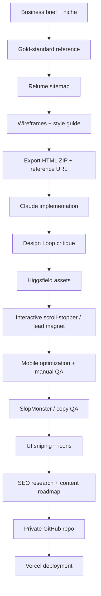

# Architecture

## Control philosophy

This is a **pipeline of specialist checks**, not one giant prompt. The important implementation idea is to freeze or improve one layer at a time: structure before polish, visual system before assets, conversion interaction before final copy, and QA before launch.

## Human gates

1. Select a credible reference rather than blindly copying aesthetics.
2. Review the sitemap and wireframes before exporting.
3. Manually inspect mobile output on real/small screens.
4. Verify every proof/statistic in copy before shipping.
5. Review SEO recommendations before producing content.
